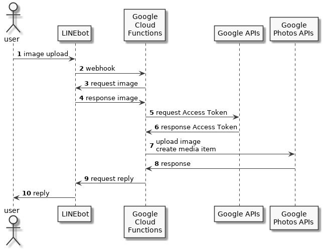

# line-to-google-photos

Use the Line Messaging API to upload images from GCP Cloud Functions to Google Photos



https://gist.github.com/kkeisuke/6e460f97ed864c4563dae1c0e52f13d0

## Build Setup

1. create `src/_config.ts`

  ```typescript
  // Line
  const LINE_CHANNEL_ACCESS_TOKEN: string = 'xxx';

  // Google API
  const CLIENT_ID: string = 'xxx';
  const CLIENT_SECRET: string = 'xxx';
  const REFRESH_TOKEN: string= 'xxx';
  ```

2. `npm install`
3. `npm run build`

## GCP Cloud Functions

[Quickstart: Using the Console](https://cloud.google.com/functions/docs/quickstart-console?hl=ja)

Paste `dest/index.min.js` in Inline editor.

## Reference

https://int128.hatenablog.com/entry/2018/06/06/234653
